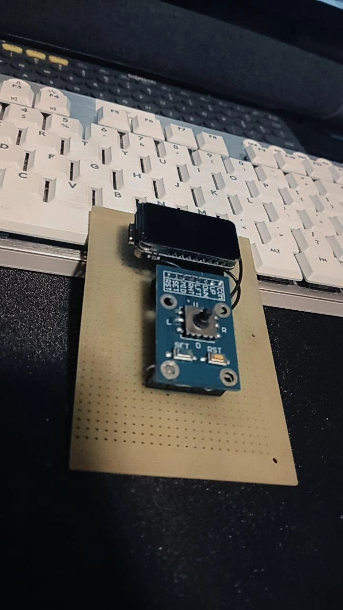
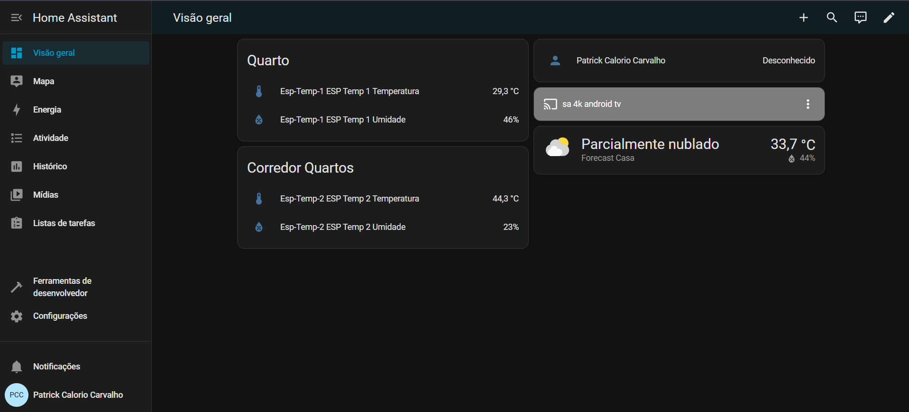
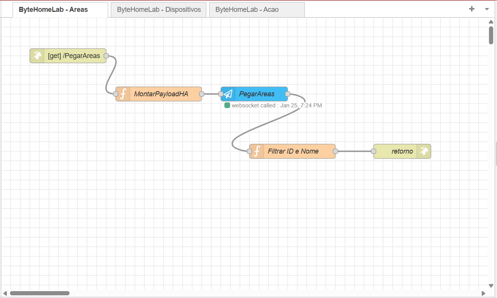
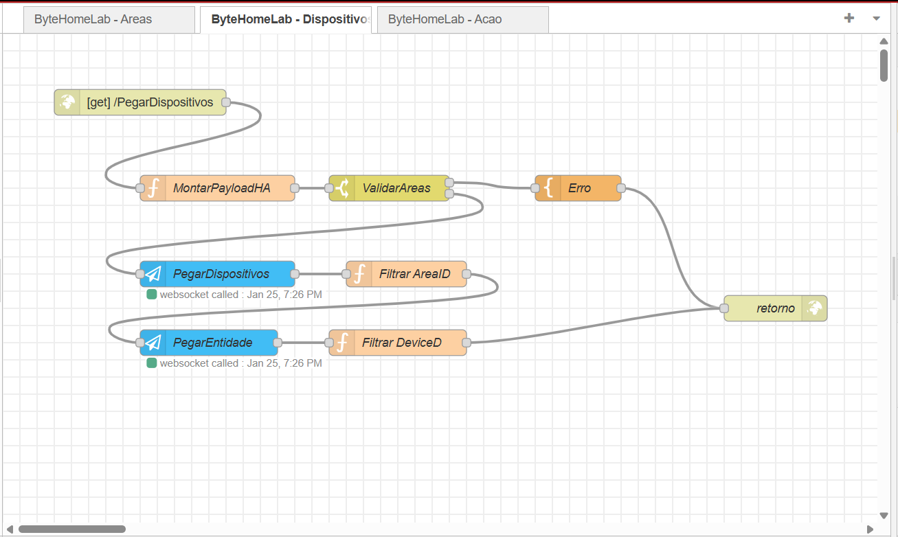
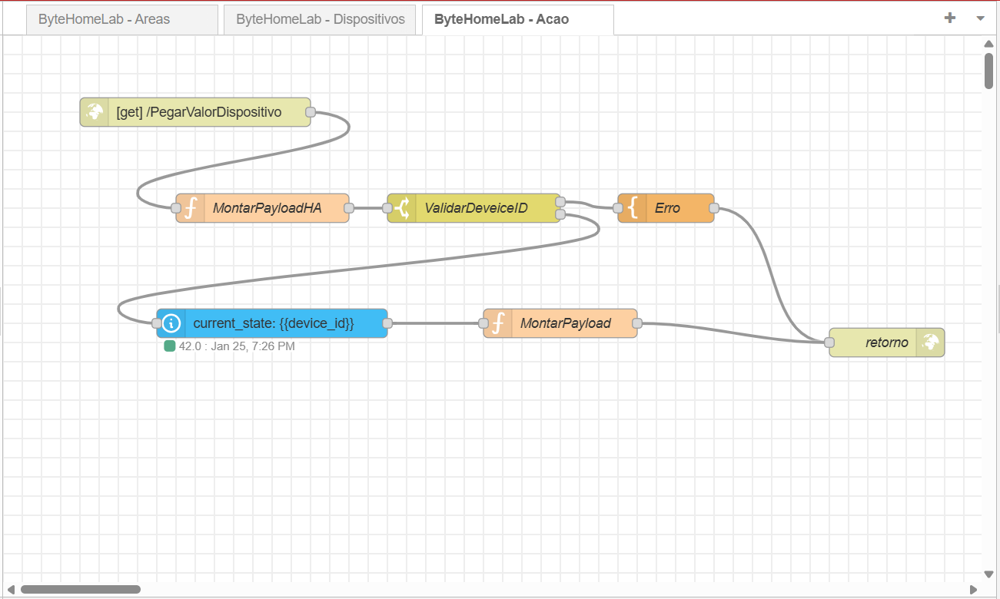

# 🏠 ByteHomeLab Remote

Controle físico com display TFT e joystick 5D para automação residencial, inspirado em interfaces clássicas como iPod, com foco em usabilidade, feedback visual e expansão futura via API.

### Board

  

### Home Assistant 

  

### Fluxo Node-Red

  
  
  

### UI

  
  

---

## 📸 Visão Geral

O **ByteHomeLab Remote** é um controle baseado em microcontrolador que utiliza:

- Display **TFT ST7789 (320x172)**

- **Joystick 5D** (direções + botões)

- **LED RGB (WS2812)** para feedback visual

- Interface gráfica com **menu navegável**

- Estrutura preparada para **submenus** e **integração com APIs**

Ideal para controle de luzes, sensores, portões, câmeras e outros dispositivos de um Home Lab ou Smart Home.

---

## ✨ Funcionalidades Atuais

- 📋 Menu principal com rolagem

- 🎯 Item selecionado com destaque visual

- ➡️ Indicador `>` no item ativo

- 🎮 Navegação via joystick:

&nbsp; - Cima / Baixo → navegar

&nbsp; - Direita / Centro / Reset → selecionar

&nbsp; - Esquerda / Set → voltar ao menu inicial

- 💡 Feedback por LED RGB:

&nbsp; - Branco: idle

&nbsp; - Azul: navegação

&nbsp; - Verde: seleção

- 🧱 Header fixo com título centralizado

- 🎨 Paleta de cores inspirada no iOS clássico

